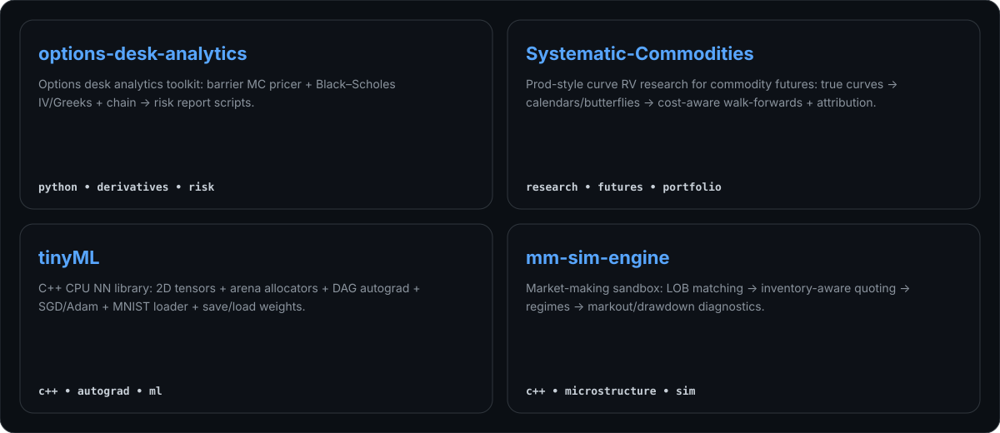

  

  

---

## Quick links

- Options desk analytics: https://github.com/xas-L/options-desk-analytics  
- Systematic commodities: https://github.com/xas-L/Systematic-Commodities  
- tinyML: https://github.com/xas-L/tinyML  
- mm sim engine: https://github.com/xas-L/mm-sim-engine  

---

### How this works

- `scripts/build.ts` generates the SVG blocks into `dist/`
- `.github/workflows/render.yml` runs daily (and manually) to regenerate + commit changes
